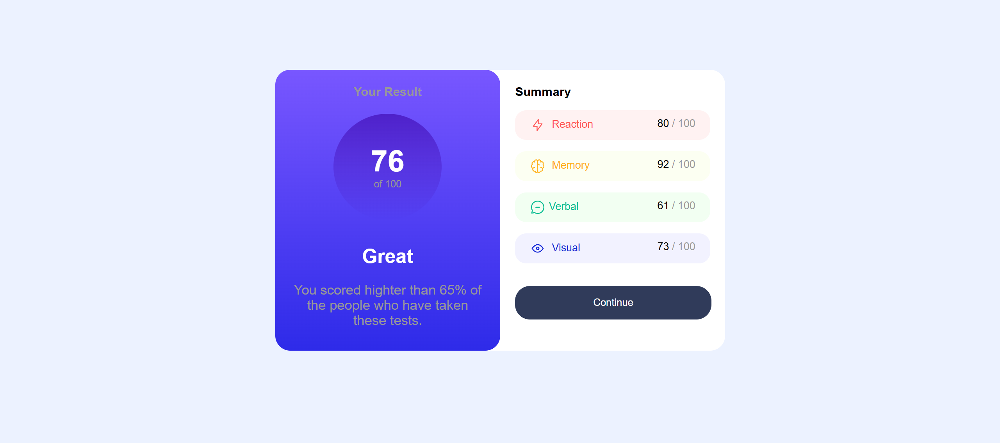

<h1 align="center">Results summary component</h1>

###

  
  
  
  
  

###

📝 Brief Your challenge is building out this results summary component and getting it as close to the design as possible.  You can use any tools you like to help you complete the challenge. So if you've got something you'd like to practice, feel free to give it a go.  We provide the data for the results in a local data.json file. So you can use that to add the results and total score dynamically if you choose.  Your users should be able to:  View the optimal layout for the interface depending on their device's screen size See hover and focus states for all interactive elements on the page Bonus: Use the local JSON data to dynamically populate the content Download the project and go through the README.md file. This will provide further details about the project and help you set it up.  Want some support on the challenge? Join our community and ask questions in the help channel.

###

https://www.frontendmentor.io/home

###

